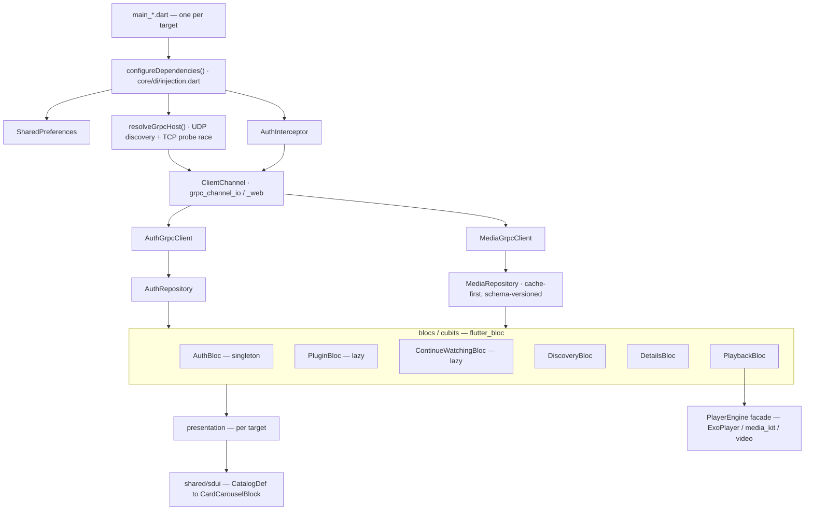

# Pileus — architettura

Riferimento di dettaglio. Il README ha la versione breve; qui il modello a
quattro target, il bootstrap, il trasporto e le convenzioni del core
condiviso.

## Quattro target, un core

Un solo albero `lib/`. Differisce solo il layer *presentation*.

| Target | `main_*.dart` | UI | Player |
|---|---|---|---|
| Android TV / Fire TV | `main.dart` | `lib/features/*/presentation/` (D-pad) | ExoPlayer (`better_player_plus`) |
| Mobile | `main_mobile.dart` | `lib/mobile/` (touch) | ExoPlayer |
| Desktop (Linux / Windows) | `main_desktop.dart` | `lib/desktop/` (mouse/tastiera) | libmpv (`media_kit`) |
| Web / PWA (spike) | `main_web.dart` | `lib/web/` + schermate `lib/desktop/` | HTML5 `<video>` + hls.js |

Condiviso da tutti: `lib/core/` (DI, gRPC/proto, router, tema, update,
device/perf profile), `lib/features/*/bloc|cubit|data`, `lib/shared/`
(SDUI, widget, util, `shared/player/`).

## Bootstrap (`core/di/injection.dart`)

Ordine, tutto in `configureDependencies()` prima del primo frame:

1. `SharedPreferences` (unico store persistente) → singleton.
2. `AuthInterceptor` → singleton. Inietta `authorization: Bearer <jwt>`,
   `x-profile-id`, `x-http-host` su ogni RPC.
3. `resolveGrpcHost()` — vedi sotto. L'host vincitore va in `DeviceSession`.
4. `AuthGrpcClient` / `MediaGrpcClient` (lazy) sul canale appena creato.
5. Repository (lazy): `AuthRepository`, `MediaRepository`,
   `SettingsRepository`, `UpdateService`.
6. `AuthBloc` **singleton** (lo stato di auth è condiviso e "svegliato"
   dallo splash). `PluginBloc` / `ContinueWatchingBloc` lazy singleton — la
   home li ritrova già caldi. `Discovery/Details/Playback` + i cubit sono
   factory.

`rebuildGrpcClients()` (cambio server): spegne il canale HTTP/2, de-registra
e ricrea client + repository, ri-punta l'`AuthInterceptor` al nuovo host,
svuota le cache legate all'host (`clearPlaybackEpisodeCache()`).

I repository sono **getter su `getIt`**, non arg catturati nel costruttore:
un bloc che tiene il repository non diventa stale dopo un rebuild.

## Router guard (`core/router/app_router.dart`)

Il JWT di sessione vive **solo in memoria**. A ogni cold start `/splash`
riesegue il bootstrap e ri-autentica. Il `redirect` lascia sempre passare le
rotte del flusso di auth (`/splash /discovery /pairing /profiles`); ogni
altra rotta richiede `AuthInterceptor.hasCredentials` o rimbalza a
`/splash`. C'è un `errorBuilder` per le rotte sconosciute.

## Trasporto

- Servizi: `AuthService`, `MediaPipeline`, `PluginService`
  (`proto/auth.proto`, `proto/media.proto`). Stub in
  `lib/core/grpc/generated/`, client sottili in `lib/core/grpc/clients/`.
- Canale a scelta di piattaforma via conditional export in
  `grpc_channel.dart`: `grpc_channel_io.dart` (nativo, `ClientChannel`) /
  `grpc_channel_web.dart` (`GrpcWebClientChannel`). Il tipo pubblico è
  `ClientChannel` da `package:grpc/service_api.dart` (senza `dart:io`), che
  entrambi implementano.
- Deadline per-RPC 20 s (`media_client.dart`); `AuthGrpcClient` ha le stesse
  `CallOptions(timeout:)`.
- **TLS trust-on-first-use**: il fingerprint SHA-256 del cert self-signed
  del server viene pinnato al primo contatto da `/pileus/info`
  (`DeviceSession.tlsFingerprint`). Null = TLS off o nessun round-trip
  ancora fatto → il canale ripiega su insicuro.

## Risoluzione host (`core/grpc/host_resolver.dart`)

Gara: broadcast UDP `MYCELIUM_DISCOVER_V1` su `:51900` **in parallelo** a un
probe TCP dei candidati (host salvato, host compilato in build, `mycelium.local`,
loopback, `10.0.2.2`, host VPN). Primo che risponde vince e viene salvato.
Su web non c'è discovery: l'app è servita *dal* server, quindi l'host è
l'origine della pagina (`host_resolver_stub.dart`).

## MediaRepository — cache-first

Le risposte di catalogo sono cache-ate in `SharedPreferences` sotto il
keyspace `layoutcache:` con TTL. Il bump di `schemaVersion` fa il wipe di
tutte le chiavi. `_client` è un getter su `getIt<MediaGrpcClient>()` (niente
stale dopo `rebuildGrpcClients()`). Gli errori `unauthenticated` su
progress / continue-watching fanno partire `SessionExpiredEvent` → routing
all'auth flow, non vengono inghiottiti.

## SDUI (`lib/shared/sdui/`)

`CatalogDef` del server → view model `CardCarouselBlock`
(`card_carousel_block_view.dart`, splittato in `part`). Contratto di
**forward-compat**: valori non riconosciuti di `card_layout` / `style_hint`
/ `section_kind` si ignorano, non fanno mai crashare. `sport_theme.dart`
(`sportAccentColor()`) per il tema delle righe sportive.

> v1 costruisce di fatto solo `CardCarouselBlock`; il resto della gerarchia
> `sealed` in `sdui_block.dart` è scaffolding per migrazioni future.

## Player — facade dual-backend

`lib/features/player/engine/player_engine.dart`: le schermate parlano solo
con `PlayerEngine`, mai coi tipi dei backend.

- Android (TV + mobile) → **ExoPlayer** via `better_player_plus`: HW decode
  MediaCodec→Surface zero-copy, fallback decoder reale, selezione tracce
  audio/sottotitoli HLS.
- Desktop → **libmpv** via `media_kit`. Su Linux il rendering S/W è un
  vincolo noto (vedi commenti in `player_engine.dart` / `PILEUS_PATCHES`).
- Web → HTML5 `<video>` in `HtmlElementView`, hls.js quando l'HLS non è
  nativo. `PlaybackBloc` (fetch stream + `ResolveStream`) è riusato as-is —
  è puro gRPC, senza engine.

La logica di *watch progress* (save / clear-at-EOF / resume-seek / lingua
audio ricordata) è condivisa da mobile + desktop in
`lib/shared/player/playback_progress.dart` (`PlaybackProgress`). TV e web
tengono la propria copia: la TV muta lo stato episodio/stagione a metà
sessione, il web non ha `PlayerEngine`.

## Persistenza

Solo `SharedPreferences`. `lib/core/db/` è naming legacy stile Isar con
classi a mano (`toJson` / `readFrom` / `writeTo`). `DeviceSession` è l'unica
riga di sessione (device id, `deviceJwt`, host, fingerprint TLS, ultimo
profilo), un blob JSON sotto una chiave.

> Hardening pianificato: `deviceJwt` → `flutter_secure_storage` con
> migrazione one-shot (pass dedicato pre-store).

## Profilo prestazioni

- `core/perf_profile.dart` — `lowPowerUi`: taglia blur / shader / le
  transizioni di rotta su hardware debole. `isAndroidTv` globale.
- `core/device_profile.dart` — rilevamento nativo `isTv` / `isWeak`
  (FEATURE_LEANBACK / UiModeManager), riletto a ogni avvio.
- `core/utils/perf_log.dart` — `perf()` / `installJankLogger()`; grep
  `pileus/perf` / `pileus/jank` in `adb logcat` (solo con diagnostica ON —
  vedi `SECURITY.md`).
- Cache immagini 64 MB / 200 voci (40 MB / 140 in low-power); ogni immagine
  decodificata alla dimensione fisica di disegno
  (`core/utils/image_sizing.dart`).
